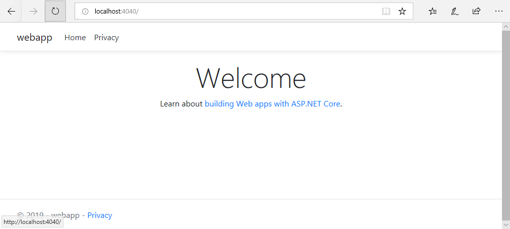

# Docker

In this demo you will be introduced to the basic Docker CLI commands. This is only an introduction, not an in depth demo.

## Prerequisites:
* Clone the GitHub repo [https://github.com/JasonHaley/GettingStartedWithAKS.git](https://github.com/JasonHaley/GettingStartedWithAKS.git)
* Docker CE needs to be installed and configured

I'm using Window Linux Subsystem using Ubuntu and Bash Shell or a bash shell inside of Visual Studio Code, but you should be able to use most commands in a command prompt or PowerShell window.

## Verify Docker is setup
First let's verify Docker CLI is setup and its able to communicate with the server.

1. Type the following command in the terminal:
```
$ docker version
```
If your Docker CLI and server are configured correctly you should see output similiar to the following:
```
Client:
 Version:           18.09.2
 API version:       1.39
 Go version:        go1.10.4
 Git commit:        6247962
 Built:             Tue Feb 26 23:52:23 2019
 OS/Arch:           linux/amd64
 Experimental:      false

Server: Docker Engine - Community
 Engine:
  Version:          18.09.2
  API version:      1.39 (minimum version 1.12)
  Go version:       go1.10.6
  Git commit:       6247962
  Built:            Sun Feb 10 04:13:06 2019
  OS/Arch:          linux/amd64
  Experimental:     false
  ```
  
Now we are good to go with the demo.
 
First, let's start with the official hello-world image from Docker (which can be found at: [https://hub.docker.com/_/hello-world](https://hub.docker.com/_/hello-world).
 
2. In your terminal, type the following:

```
$ docker pull hello-world
```
This will pull the image down from DockerHub to your machine and some output like this:
```
Using default tag: latest
latest: Pulling from library/hello-world
1b930d010525: Pull complete
Digest: sha256:41a65640635299bab090f783209c1e3a3f11934cf7756b09cb2f1e02147c6ed8
Status: Downloaded newer image for hello-world:latest
```

3. List the images on your system:

```
$ docker images
```

You should see a listing that contains the hello-world image. Note: you may have more images in your list.

```
REPOSITORY                                 TAG                 IMAGE ID            CREATED             SIZE
hello-world                                latest              fce289e99eb9        5 months ago        1.84kB
```

Now let's run the container.

3. In your terminal, type the following:

```
$ docker run hello-world
```
This runs the hello-world application in the container image and terminates, showing output like the following in your terminal:
```

Hello from Docker!
This message shows that your installation appears to be working correctly.

To generate this message, Docker took the following steps:
 1. The Docker client contacted the Docker daemon.
 2. The Docker daemon pulled the "hello-world" image from the Docker Hub.
    (amd64)
 3. The Docker daemon created a new container from that image which runs the
    executable that produces the output you are currently reading.
 4. The Docker daemon streamed that output to the Docker client, which sent it
    to your terminal.

To try something more ambitious, you can run an Ubuntu container with:
 $ docker run -it ubuntu bash

Share images, automate workflows, and more with a free Docker ID:
 https://hub.docker.com/

For more examples and ideas, visit:
 https://docs.docker.com/get-started/
```
Now that you've verified your docker is setup and run a hello-world container, let's move on to building an image for an ASP.NET Core application and exploring a few more Docker CLI commands.

## ASP.NET Core
In the GitHub repo, find the directory `demos\1-create-a-docker-container-image\webapp` and open the webapp directory in Visual Studio Code.

You can explore the code in this application if you want, but its not too exciting - it is just the .NET Core application template.

Find the Dockerfile in the webapp directory and take a look at it. It is a multi-stage build file that I created using VS 2019 - this also hasn't been modified. Below is the text to that Dockerfile

```
FROM mcr.microsoft.com/dotnet/core/aspnet:2.2-stretch-slim AS base
WORKDIR /app
EXPOSE 80
EXPOSE 443

FROM mcr.microsoft.com/dotnet/core/sdk:2.2-stretch AS build
WORKDIR /src
COPY ["webapp.csproj", ""]
RUN dotnet restore "webapp.csproj"
COPY . .
WORKDIR "/src/"
RUN dotnet build "webapp.csproj" -c Release -o /app

FROM build AS publish
RUN dotnet publish "webapp.csproj" -c Release -o /app

FROM base AS final
WORKDIR /app
COPY --from=publish /app .
ENTRYPOINT ["dotnet", "webapp.dll"]
```

Since this isn't a detailed look at Docker, I just want you to get an idea of what the Dockerfile has in it. Multi-stage Dockerfiles are usually written with the parts that change the least at the top. It has 4 stages that mostly do the following:
1. Set a base image to use, a working directory and the ports to expose.
2. Copy the project file over to a working image (based on the sdk image), run dotnet restore to get the project ready to build, then build it.
3. Starting with the result from step 2, publish the app 
4. Using the base imge from step 1, copy the results from the publish over to the image and set an entry point for the command dotnet webapp.dll.

Now, let's build the image using this docker file.

1. In your terminal and at the directory of the webapp run the following command:
```
$ docker build -t webapp -f Dockerfile .
```

This will take a 20 seconds or so (depending on your machine). The ouptut generated in the terminal should look like this:
```
Sending build context to Docker daemon  4.399MB
Step 1/17 : FROM mcr.microsoft.com/dotnet/core/aspnet:2.2-stretch-slim AS base
 ---> df2a085ca3a8
Step 2/17 : WORKDIR /app
 ---> Using cache
 ---> 4c454e8768e7
Step 3/17 : EXPOSE 80
 ---> Using cache
 ---> b319d214a5bc
Step 4/17 : EXPOSE 443
 ---> Using cache
 ---> a42e35e12577
Step 5/17 : FROM mcr.microsoft.com/dotnet/core/sdk:2.2-stretch AS build
 ---> 874f441aa614
Step 6/17 : WORKDIR /src
 ---> Using cache
 ---> 6b9b125f7368
Step 7/17 : COPY ["webapp.csproj", ""]
 ---> 056ee650b8eb
Step 8/17 : RUN dotnet restore "webapp.csproj"
 ---> Running in 2a5d6998a65e
  Restore completed in 2.81 sec for /src/webapp.csproj.
Removing intermediate container 2a5d6998a65e
 ---> 8b2f02ffc2c5
Step 9/17 : COPY . .
 ---> 6e86958ede73
Step 10/17 : WORKDIR "/src/"
 ---> Running in 7351154067c5
Removing intermediate container 7351154067c5
 ---> 0a214e6456a1
Step 11/17 : RUN dotnet build "webapp.csproj" -c Release -o /app
 ---> Running in ac7dccecb1a0
Microsoft (R) Build Engine version 16.0.450+ga8dc7f1d34 for .NET Core
Copyright (C) Microsoft Corporation. All rights reserved.

  Restore completed in 73.2 ms for /src/webapp.csproj.
  webapp -> /app/webapp.dll
  webapp -> /app/webapp.Views.dll

Build succeeded.
    0 Warning(s)
    0 Error(s)

Time Elapsed 00:00:06.54
Removing intermediate container ac7dccecb1a0
 ---> 5b7e2017b31a
Step 12/17 : FROM build AS publish
 ---> 5b7e2017b31a
Step 13/17 : RUN dotnet publish "webapp.csproj" -c Release -o /app
 ---> Running in 1d79499fb2b3
Microsoft (R) Build Engine version 16.0.450+ga8dc7f1d34 for .NET Core
Copyright (C) Microsoft Corporation. All rights reserved.

  Restore completed in 60.59 ms for /src/webapp.csproj.
  webapp -> /src/bin/Release/netcoreapp2.2/webapp.dll
  webapp -> /src/bin/Release/netcoreapp2.2/webapp.Views.dll
  webapp -> /app/
Removing intermediate container 1d79499fb2b3
 ---> 736df71c5a67
Step 14/17 : FROM base AS final
 ---> a42e35e12577
Step 15/17 : WORKDIR /app
 ---> Using cache
 ---> 839475fa4334
Step 16/17 : COPY --from=publish /app .
 ---> 148fb2d7b94e
Step 17/17 : ENTRYPOINT ["dotnet", "webapp.dll"]
 ---> Running in 662b6cf85950
Removing intermediate container 662b6cf85950
 ---> 05ef1d26fc83
Successfully built 05ef1d26fc83
Successfully tagged webapp:latest
SECURITY WARNING: You are building a Docker image from Windows against a non-Windows Docker host. All files and directories added to build context will have '-rwxr-xr-x' permissions. It is recommended to double check and reset permissions for sensitive files and directories.
```

The output walks you through all the steps the builder is taking to create the image for you.

Now verify the image is on your machine (we gave it a tag so it is easier to find - that was the "**-t webapp**" in the command above).

2. List the images on your machine:

```
$ docker images
```
The listing will show the most recent at the top, you should see the webapp in the listing.
```
REPOSITORY                                     TAG                        IMAGE ID            CREATED             SIZE
webapp                                         latest                     05ef1d26fc83        2 minutes ago       265MB
```

Now let's run it. We know know from the Dockerfile that is it going to expose port 80 and 443, so lets map it to run on our local machine to a different port to ensure there won't be a collision.

3. Run the image mapping it to port 4040, give it a name and run it in detached mode.
```
$ docker run --name webapp -d -p 4040:80 webapp
```
1fe991d6755bfcdcd3815485e5c4f4317808ae4572b4c5038eadf39f62416cd5
```
The port mapping syntax <host port>:<container port>. The detached mode will start the container and not block our terminal.

You can now go to a browser on your machine and navigate to localhost:4040 and you should see the following web page:



Now you have build an image and started it as a container. One last thing to do a little clean up.

4. View the list of containers running on your machine:
```
$ docker ps
```
You should see the webapp container:
CONTAINER ID        IMAGE               COMMAND               CREATED             STATUS              PORTS                           NAMES
1fe991d6755b        webapp              "dotnet webapp.dll"   6 minutes ago       Up 6 minutes        443/tcp, 0.0.0.0:4040->80/tcp   webapp
```
5. Kill the webapp container:
```
$ docker kill webapp
```
## Next Step

The next step will be to deploy the webapp in the local Kubernetes.
